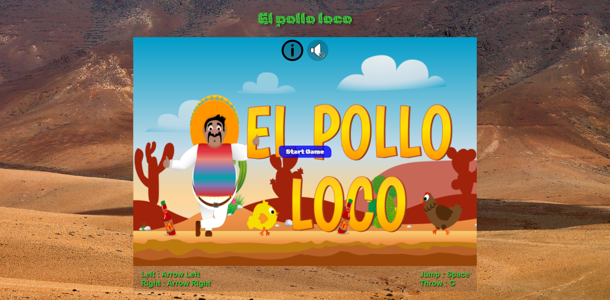
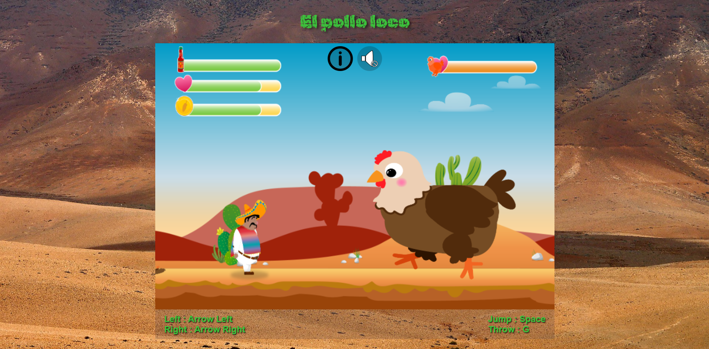
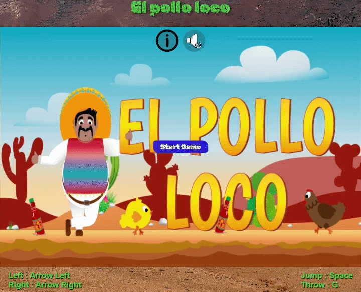

<div align="center">
  <h1>El Pollo Loco</h1>
  <p>
  A browser-based jump-and-run game inspired by El Pollo Loco, built with an object-oriented JavaScript approach.

  Players control Pepe through animated levels, collect coins and tabasco bottles, and fight against crazy chickens using throwable salsa bottles.

  The game uses HTML5 Canvas rendering for animations, movement, collision detection, and game interactions.
  </p>
</div>

<h2>Features</h2>

<ul>
  <li>Object-oriented JavaScript architecture</li>
  <li>HTML5 Canvas rendering</li>
  <li>Animated character and enemy sprites</li>
  <li>Collision detection system</li>
  <li>Throwable tabasco bottles</li>
  <li>Collectible coins and items</li>
  <li>Enemy AI and movement patterns</li>
  <li>Responsive keyboard controls</li>
  <li>Side-scrolling camera movement</li>
</ul>

<h2>Technologies</h2>

<p align="center">
  

  

  

  
</p>

<h2>Preview</h2>
<div align="center">

  

  
</div>
<div align="center">
  
</div>

<h2>Live Demo</h2>
<p align="center">
  <a href="https://el-pollo-loco.gross-david.de/" target="_blank">
    
  </a>
</p>

<h2>Controls</h2>

<ul>
  <li>Arrow Left / Right → Move</li>
  <li>Space → Jump</li>
  <li>G → Throw bottle</li>
</ul>

<h2>Installation</h2>
<p>Clone the repository:</p>

```bash
git clone https://github.com/DavidGrossDev/el_pollo_loco.git
```
<p>
Open the project folder and launch <code>index.html</code> in your browser.
</p>

<h2>Project Structure</h2>

```text
el_pollo_loco/
│
├── index.html
├── style.css
├── impressum.html
├── impressum.css
├── js/
│   └── game.js
├── levels/
│   └── level1.js
├── models/
│   ├── background_object.class.js
│   ├── bottle.class.js
│   ├── character.class.js
│   ├── chicken.class.js
│   ├── cloud.class.js
│   ├── coins.class.js
│   ├── drawable_object.class.js
│   ├── endboss.class.js
│   ├── keyboard.class.js
│   ├── level.class.js
│   ├── movable_object.class.js
│   ├── screen.class.js
│   ├── status_bar.class.js
│   ├── throwable_object.class.js
│   └── world.class.js
├── img/
│   ├── character/
│   ├── enemies_chicken/
│   ├── boss_chicken/
│   ├── background/
│   ├── bottle/
│   ├── statusbars/
│   ├── coin/
│   ├── screens/
│   └── assets/
├── sounds/
└── screenshots/
```

<h2>What I Learned</h2>

<ul>
  <li>Object-oriented programming in JavaScript</li>
  <li>Game loop and animation handling</li>
  <li>Canvas rendering techniques</li>
  <li>Collision detection systems</li>
  <li>Sprite-based animations</li>
  <li>Keyboard input handling</li>
  <li>Managing game states and interactions</li>
</ul>

<h2>Author</h2>
<p>David Groß</p>
<p>GitHub: <a href="https://github.com/DavidGrossDev">DavidGrossDev</a></p>
